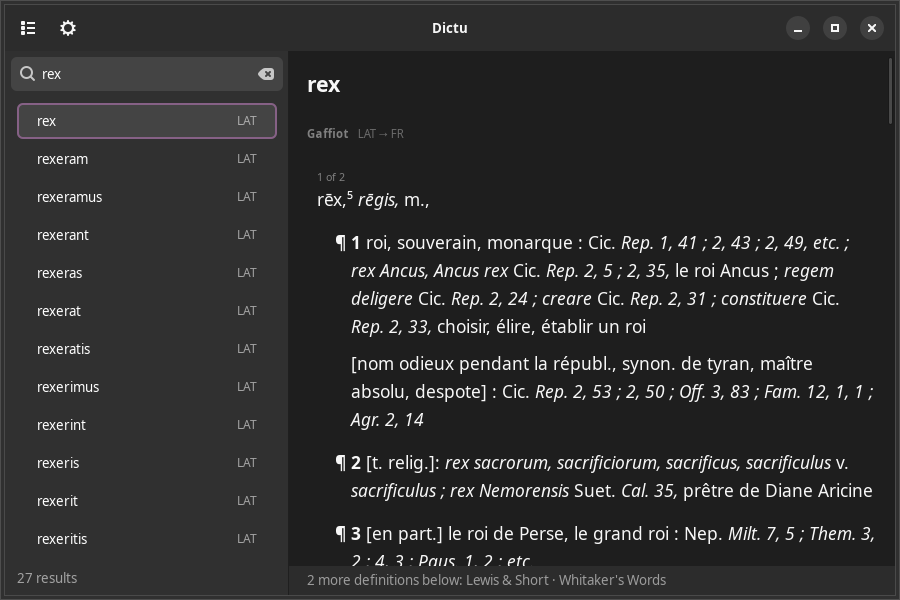

# dictu

An offline dictionary gnome app; vibe-coded with claude



it scans directories of dictionary files, builds one merged index across all of them, and
answers a single search box with every definition a word has, from every dictionary that
has it.

built for classical-language work — inflected Latin, Greek, Hebrew lexica of a few million
headwords — where the usual answer is a heavyweight app or a browser tab. dictu is a
native gtk4 window, reads the files where they already sit, and never touches the network.

status: **alpha**, and honestly so. it works daily; what is left is tracked in
[`roadmap.md`](roadmap.md) and what is finished in [`done.md`](done.md), each item with the
reasoning that produced it. the next piece of work — typo-tolerant search, and a query typed
in latin letters that finds a greek or hebrew word — is planned in
[`docs/search-index-plan.md`](docs/search-index-plan.md).

```
$ dictu search dacrima
5 results
  [Whitaker's Words] dacrima
  [Gaffiot] dacrima
  [Lewis & Short] dacrima
  [Whitaker's Words] dacrimae
  ...
```

there are no dictionaries in this repository — they are somebody else's work, and most of
the good ones are under copyright. dictu reads what you already have, wherever it sits.
the only dictionary here is `sample/`, seven made-up words used by the tests.

## features

**one search across every dictionary.** all headwords from all dictionaries go into a
single case-insensitive index. typing a prefix searches the whole collection at once;
picking a word shows its definition from each dictionary that defines it, one under the
other, each under its source label.

**no browser engine.** definitions arrive as html. dictu parses it with html5ever and maps
a controlled subset of tags — `b`, `i`, `sup`/`sub`, headers, `a`, `tt`, block elements —
onto its own text styles, then renders those with `gtk::TextView` tags. every dictionary's
own inline css, colours and classes are **ignored on purpose**, so a 19th-century lexicon
and a modern glossary render in the same consistent look rather than a collage.

**it starts in a tenth of a second.** the parsed index of every dictionary, and the merged
order across all of them, are cached to `$XDG_CACHE_HOME/dictu/` and memory-mapped back.
over the 15 dictionaries and 1,936,120 headwords this was written against, a first run
takes **1.6 s** and peaks at 550 MB; every run after that takes **0.11 s** and 190 MB.
(release build, one machine, one collection — `dictu index` prints yours.) the cache is
keyed by the path, timestamp,
size and sampled content of every file an index was built from, so a replaced or edited
dictionary rebuilds rather than being answered from a stale index.

**built for millions of headwords.** the index stores two `u32`s per headword, not the
words themselves; prefix search is a binary search plus a walk of the matching run.
`.dict` files are memory-mapped, so definitions are paged in by the kernel on demand
instead of read into RAM (the largest dictionary here is 178 MB). indexing runs on a
worker thread, so the window is up and responsive while it works.

**single instance with a lookup hotkey.** `dictu --search WORD` forwards to the
already-running window, focuses it and fills the search box. bound to a shell hotkey
(`Super+F2` → read the primary selection → `dictu --search "$word"`), it turns any selected
word anywhere on the desktop into a lookup.

**no-gui subcommands.** `dictu dump <file>` prints one dictionary's metadata and first
entries; `dictu lookup <file> <word> [--html]` prints a single entry, which is how two
dictionaries' coverage of the same word gets compared; `dictu search <query>` runs the real
search engine and prints the hits. all three work without a display, which is how parsing
and search get verified.

### dictionary formats

| format | files | status |
| --- | --- | --- |
| StarDict | `.ifo` + `.idx` + `.dict`/`.dict.dz`, optional `.syn` synonyms | supported |
| dictd | `.index` + `.dict`/`.dict.dz` | supported |
| csv | tab-separated (the LSJ author/work abbreviation table) | supported |
| ABBYY Lingvo DSL | `.dsl`, `.dsl.dz` (UTF-16 or UTF-8, plain or gzipped) | supported |
| Babylon | `.bgl` | convert to StarDict with pyglossary first |

gzip and dictzip (`.dz`) are read transparently, with a decompression cap as a zip-bomb
guard.

## the parts

| path | what it does |
| --- | --- |
| `src/main.rs` | starts the application, and hands a word arriving from the global hotkey to the window. ~80 lines: everything else moved out |
| `src/ui/mod.rs` | the window — sidebar search + wordlist (a `ListView` over a model), definition pane, the scope panel, the off-thread index load, and every signal handler |
| `src/ui/render.rs` | definition typography: the `TextTag`s a definition is dressed in, and the paragraph structure laid over its body |
| `src/collection.rs` | the loaded collection plus what the reader has decided about it (which dictionaries are in scope, whether repeated forms are folded), and every query over it. has never heard of gtk, so both front ends ask it the same questions |
| `src/cli.rs` | the second front end: `search`/`define`/`scope`/`index` ask the collection, `dump`/`lookup` read a file the app was never told about, `--json` on all of them |
| `src/keys.rs` | key normalization — case folding, and the diacritics a query may leave off versus the ones it means |
| `src/language.rs` | which language a headword's script belongs to, for the tag on a wordlist row |
| `src/shortcut.rs` | the desktop's own global shortcut — reads and rewrites the GNOME custom keybinding that binds a key to `dictu --search` |
| `src/config.rs` | `config.toml` (xdg), and the recursive directory scan that discovers dictionaries and classifies them by format |
| `src/library.rs` | the dictionaries as one index: opens every one, builds the merged sorted order, answers prefix searches and cross-dictionary lookups. `collection` above wraps it with what the reader has decided |
| `src/dict/mod.rs` | the `Dictionary` trait every format implements, format classification, mmap and gzip plumbing |
| `src/dict/stardict.rs` | StarDict reader — `.ifo` metadata, big-endian `.idx`, `sametypesequence`, `.syn` synonyms |
| `src/dict/dictd.rs` | dictd reader — the tab-separated `.index` with dictd's own base-64 offset encoding |
| `src/dict/csv.rs` | the tab-separated LSJ abbreviations table |
| `src/dict/dsl.rs` | ABBYY Lingvo DSL reader — mixed UTF-16/UTF-8, multi-headword cards, its own bracket markup converted to html |
| `src/index_cache.rs` | the on-disk index cache: each dictionary's parsed index and the merged order, mmapped back, keyed by the files they came from |
| `src/dict/markup.rs` | html → styled text runs. ui-agnostic (no gtk), so it's unit-testable |
| `sample/` | a small hand-built dictd fixture used by the smoke tests and ui e2e |
| `hack/` | the feedback loop — `check.sh` runs all of it; `cli.py` drives the command line over the fixture, `e2e.py` drives the real widget tree over at-spi, `speed.py` compares the app against a recorded run, `shot.sh` screenshots it |

the data layer knows nothing about gtk, and the ui knows nothing about dictionary file
layouts — `Dictionary` is the whole contract between them: a name, a list of headwords, and
`lookup(headword) -> Vec<html>` — every entry filed under that word. adding a format means
implementing that trait and teaching `classify` its extension.

above that, `collection` is the contract between the *front ends*: the window and the command
line ask it the same questions and print the same answers, which is what stops them drifting
into describing one search two ways. `main` in turn knows the window by four names only — the
handle, `build`, `present`, and `search_from_outside`.

## configuration

`~/.config/dictu/config.toml`, written with defaults on first run:

```toml
dictionary_dirs = ["/home/you/Dictionaries"]
```

each plain path is scanned recursively for dictionaries. a path prefixed with `!` excludes
everything beneath it — the inverse of gitignore's `!` — which is how a dictionary is
dropped from the collection without moving files.

## building

needs rust (2024 edition) and the gtk4 + libadwaita development headers:

```bash
sudo apt install -y libgtk-4-dev libadwaita-1-dev build-essential pkg-config
cargo build
```

then run the checks — format, lint, unit tests, cli smoke tests, and a ui end-to-end pass
that drives the real widget tree over the accessibility bus:

```bash
hack/check.sh
```

## licence

the code is **GPL-3.0-or-later** — see [`LICENSE`](LICENSE).

the two pictures in `assets/` are not mine to license that way. they are details of one
manuscript page, photographed by the Bodleian Libraries and released under **CC BY-NC
4.0** — attribution, non-commercial. [`assets/ATTRIBUTION.md`](assets/ATTRIBUTION.md) has
the credit in full and the IIIF coordinates to re-cut them. if you fork this for anything
commercial, the code is yours to use and the pictures are not: replace them.

no dictionaries are included, and none ever were. dictu reads the files you already have.

## the working process

[`AGENTS.md`](AGENTS.md) documents the whole working process: the loop, how to screenshot
the app unattended, the at-spi harness, and the gotchas worth not rediscovering.
